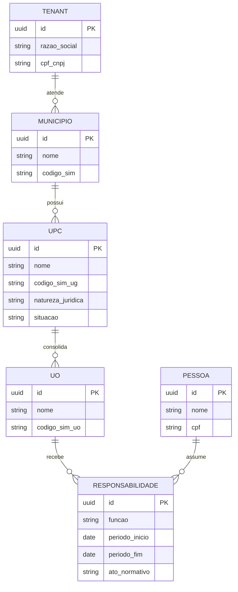

# PRD — Sistema de Gestão de Prestação de Contas Municipal (TCE-CE)

**Status:** Rascunho vivo — v0.1
**Base regulatória:** IN TCE-CE nº 01/2025 (atualizada pela Portaria nº 51/2026) + Manual do SIM 2026

> Este documento é vivo. Seções marcadas com `[DECISÃO PENDENTE]` ainda não foram fechadas — o objetivo é fechá-las em conversa, não adivinhar.

---

## 1. Contexto e problema

O TCE-CE passou a exigir, pela IN 01/2025, prestações de contas de gestão (PCS) municipais estruturadas por Unidade Prestadora de Contas (UPC), com documentos e modelos padronizados (Anexos I a VI, 21 Modelos no Apêndice I), envio exclusivamente eletrônico, assinatura digital ICP-Brasil e prazo de 180 dias.

Hoje esse trabalho é feito majoritariamente em planilhas soltas, por escritórios de contabilidade que atendem múltiplos municípios e dezenas de UPCs simultaneamente, sem controle gerencial centralizado de prazo, progresso ou responsabilidade.

O município já envia mensalmente ao TCE, via SIM (Sistema de Informações Municipais), dados estruturados que cobrem boa parte do que a IN exige. Existe uma oportunidade real de automatizar parte do preenchimento a partir do SIM, mantendo controle humano sobre os itens narrativos/de julgamento.

## 2. Objetivo do produto

- Centralizar o preenchimento, controle e entrega das PCS municipais (Anexos I-VI da IN 01/2025) numa plataforma web multi-tenant.
- Reduzir o trabalho manual repetitivo via importação de dados do SIM, sem remover a revisão humana onde ela é obrigatória (itens narrativos, de julgamento profissional ou que exigem assinatura/certificação externa).
- Dar visibilidade gerencial de prazo e progresso por UPC para escritórios que administram um volume alto de unidades em paralelo.

## 3. Personas

| Persona | Perfil | Necessidade principal |
|---|---|---|
| Escritório de contabilidade | Atende N municípios, dezenas a centenas de UPCs | Visão consolidada de prazos/progresso; reuso de pessoas/responsáveis entre UPCs |
| Contador autônomo / assessoria pequena | 1 município, poucas UPCs | Simplicidade, sem overhead de gestão multi-cliente |
| Papéis internos do tenant | Admin, Contador, Financeiro, RH/Pessoal, Patrimônio/Almoxarifado, Controle Interno | Acesso por módulo conforme a função (ex.: RH só edita Modelo 19, Patrimônio só edita inventários) |

## 4. Escopo do MVP (v1) — ✅ CONFIRMADO

**Decisão:** v1 cobre **Anexo I + Anexo II** (órgãos da administração direta — Executivo e Legislativo —, autarquias e fundações públicas de direito público), que representa a maior parte das UPCs em volume (cada secretaria/órgão/fundo tende a ter sua própria UG no SIM).

Deixar para fases seguintes:
- **v2:** RPPS (Anexo III — 56 itens, forte componente atuarial/MTP, baixo volume por município mas alta complexidade)
- **v2/v3:** Empresas estatais e fundações de direito privado (Anexo IV/V — regras da Lei 13.303/2016, pouco frequente)
- **v3:** Consórcios públicos (Anexo VI — entidade compartilhada entre municípios, modelo de tenant diferente)
- **v2:** Prestação de Contas **Parcial** (Modelo 20) — fluxo de exoneração no meio do exercício

**Pergunta aberta:** confirmar se essa priorização bate com a realidade de demanda dos primeiros clientes-piloto.

## 5. Fora de escopo (v1)

- Assinatura digital ICP-Brasil integrada nativamente (v1: usuário assina externamente e faz upload do PDF já assinado)
- Envio automatizado direto ao TCE via integração de sistemas (v1: gera o pacote pronto para envio manual pelo Portal de Serviços do TCE)
- Importação automática de Material de Consumo/estoque (não encontrei tabela equivalente no SIM — ver seção 9)
- Geração automática de texto para Notas Explicativas, pareceres de auditoria e relatórios de controle interno (permanecem campos manuais)

## 6. Modelo de dados (visão de alto nível)

**Notas de modelagem (já validadas na conversa):**
- UPC ≠ UO. UPC = Unidade Gestora (Art. 7º da IN); UO é subordinada e consolidada dentro da UPC (Art. 14).
- `PESSOA` é separada de `RESPONSABILIDADE` porque a mesma pessoa física se repete como responsável em várias UPCs (e às vezes em vários municípios do mesmo tenant).
- `RESPONSABILIDADE` carrega período de gestão, função e ato normativo — suporta múltiplos responsáveis na mesma UO ao longo do exercício (troca de gestor no meio do ano).

## 7. Motor de regras documentais (núcleo funcional do produto)

**Entrada:** natureza jurídica da UPC + categoria(s) adicionais aplicáveis (Poder Legislativo / responsável pela Educação / responsável pela Saúde / Demais Fundos / Controladoria / autarquia-fundação) + situação (ativa/extinta/etc.)

**Saída:** checklist dinâmica dos itens obrigatórios para aquela UPC naquele exercício.

| Natureza jurídica da UPC | Anexo base | Anexo II (condicional) |
|---|---|---|
| Órgão direto (Executivo/Legislativo), autarquia, fundação pública de direito público | Anexo I | Conforme categoria: Legislativo, Educação, Demais Fundos, Autarquias/Fundações, Controladoria, Saúde |
| RPPS (qualquer natureza jurídica) | Anexo III | — |
| Empresa estatal / fundação de direito privado | Anexo IV | Anexo V se for estatal dependente (LC 101/2000) |
| Consórcio público | Anexo VI | — |

Regra adicional: se a UPC consolida unidades que se encaixam em mais de uma categoria do Anexo II (ex.: UG que inclui o Fundo de Saúde), a documentação adicional de todas as categorias aplicáveis compõe a mesma prestação de contas (Art. 8º §2º).

## 8. Classificação de cada item da checklist (tipo de preenchimento)

A automação correta é **por campo/quadro dentro do modelo**, não por documento inteiro:

| Tipo | Descrição | Exemplos | Fonte |
|---|---|---|---|
| Automático | Vem direto do SIM, sem intervenção | Balancete Contábil (28), Demonstrações Lei 4.320 (9-13), Restos a Pagar (Modelo 04) | Tabelas 200-series, 300-series, 600-series |
| Híbrido | Pré-preenchido do SIM, exige revisão/complemento humano | Termo de Conferência de Caixa (Modelo 03), Contribuições Previdenciárias (Modelo 08/08-A) | Tabelas 951-959 + conciliação manual |
| Manual estruturado | Formulário com campos fixos, sem fonte automática | Rol de Responsáveis (Modelo 01) | Entrada manual, com sugestão de cargo via tabela 951 |
| Manual narrativo | Texto livre, julgamento profissional | Notas Explicativas, Pareceres/Certificados de Auditoria, Pronunciamento sobre Controle Interno | Redação humana |
| Documento externo | Upload de PDF, sem geração pelo sistema | Extratos bancários, Certidão CRC do contador, Atas, Leis | Upload + indicação do signatário |
| Declaração de inexistência | Substitui o item quando não há documento aplicável | Qualquer item, conforme Art. 15 | Formulário padronizado de justificativa |

### 8.1 Checklist completa do MVP — Anexo I (29 itens, comuns a toda UPC de órgão direto/autarquia/fundação)

| # | Item | Classificação |
|---|---|---|
| 1 | Rol de Responsáveis (Modelo 01) | Manual estruturado |
| 2 | Relatório de Desempenho da Gestão (Modelo 02) | Híbrido (quadros automáticos + 2 campos narrativos) |
| 3-7 | Balanço Orçamentário, Financeiro, Patrimonial, DVP, DFC | Automático |
| 8 | Notas Explicativas | Manual narrativo |
| 9-13 | Demonstrações da Lei 4.320 (Anexos 1, 6, 7, 16, 17) | Automático |
| 14-15 | Extratos bancários (1/jan e 31/dez) | Documento externo |
| 16 | Termo de Conferência de Caixa (Modelo 03) | Híbrido |
| 17 | Restos a Pagar (Modelo 04) | Automático |
| 18 | Plano de Contratações Anual | Documento externo |
| 19 | Inventário de Material de Consumo | Manual / CSV (gap de SIM) |
| 20-22 | Inventários de Bens Móveis, Imóveis, Intangíveis | Automático |
| 23 | Relatório de Auditoria Interna | Manual narrativo / documento externo |
| 24-25 | Parecer e Certificado de Auditoria | Documento externo |
| 26 | Pronunciamento sobre Controle Interno | Manual narrativo (declaração formal) |
| 27 | Certidão CRC do contador | Documento externo |
| 28 | Balancete Contábil | Automático |
| 29 | Contribuições Previdenciárias (Modelo 08) | Híbrido |

**Leitura honesta do resultado:** ~15 dos 29 itens (≈52%) são automáticos ou quase, ~4 são híbridos, ~10 ficam entre manual narrativo e documento externo. Isso confere com a tese original do "automatizar boa parte do preenchimento quantitativo", mas a parte narrativa/de assinatura externa continua sendo, estruturalmente, manual — não há como reduzir isso, é onde a IN exige julgamento profissional ou certificação de terceiros.

### 8.2 Itens adicionais do Anexo II (condicionais por categoria de UO/UPC)

| Categoria da unidade | Item adicional | Classificação |
|---|---|---|
| Poder Legislativo | Demonstrativo de Subsídios (Modelo 05) + Lei do subsídio | Híbrido + Documento externo |
| Educação (FUNDEB) | Demonstrativo FUNDEB (Modelo 06) + Parecer do Conselho | Híbrido + Documento externo |
| Demais Fundos | Lei de criação + Relatório do Conselho do Fundo | Documento externo |
| Autarquias/Fundações | Lei de criação e alterações | Documento externo |
| Controladoria (Controle Interno) | Relatório de Controle Interno (RCI) + Plano Anual de Auditoria + Cronograma trimestral | Manual narrativo + Manual estruturado |
| Saúde | Relatório de Gestão da Saúde (Lei 8.142/90) | Documento externo |

## 9. Mapeamento SIM → IN (confirmado por leitura direta do Manual SIM 2026)

| Bloco de tabelas SIM | Conteúdo | Itens da IN atendidos |
|---|---|---|
| 101, 103, 104, 108, 109, 110 | Gestores, Órgãos, UOs, UGs, Ordenadores, Empresas Estatais | Cadastral (UPC/UO/Pessoa) |
| 200-205 | Orçamento, receita, despesa, projetos/atividades, programas | Balanço Orçamentário, Quadro 02 do Modelo 02 |
| 301-305 | Balancetes (305 = todos os grupos de contas) | Balanço Financeiro/Patrimonial, DVP, Balancete (item 28) |
| 601-614 | Empenho, liquidação, pagamento | Restos a Pagar (Modelo 04), DEA (Quadro 16) |
| 951-959 | Agentes públicos, folha de pagamento | Rol de Responsáveis (Modelo 01 — campo "Cargo" = campo 40 da tabela 951), Contribuições Previdenciárias |
| 980-982 | Bens incorporados, depreciação, reavaliação | Inventário de Bens Móveis/Imóveis (itens 20-21) |
| 989 | Veículos | Complementar a patrimônio |

**Gap identificado:** não há tabela SIM equivalente a estoque/material de consumo (item 19, almoxarifado) — provável necessidade de integração separada ou import manual/CSV.

**Fora do MVP:** as tabelas 501-506 (processos licitatórios/contratos) não são consumidas no v1 — o Mapa de Licitações (Modelo 17) e a Relação de Pagamentos (Modelo 16) só são exigidos no Anexo IV (empresas estatais) e Anexo VI (consórcios), ambos fora do escopo do MVP.

## 10. Requisitos funcionais (módulos do MVP)

1. Autenticação e multi-tenancy (isolamento por tenant via Row-Level Security)
2. Cadastro hierárquico: Município → UPC → UO → Pessoa/Responsabilidade
3. Importador SIM: upload do `.zip`, parser dos `.txt` (ASCII MS-DOS, separado por vírgula), staging/quarentena antes da carga oficial
4. Motor de regras: monta a checklist por UPC conforme seção 7
5. Preenchimento de modelos: UI tipo planilha para campos automáticos/híbridos + campos de texto livre para itens narrativos
6. Upload de anexos PDF (limite 15MB/arquivo — Art. 23 §3º; suporte a OCR para documentos digitalizados)
7. Controle de progresso (% por item, por modelo, por UPC) e alerta de prazo (180 dias — Art. 5º)
8. Declaração de inexistência (Art. 15) como substituto formal de item
9. Exportação/consolidação do pacote final por UPC
10. `[v2]` Assinatura digital ICP-Brasil
11. `[v2]` Envio direto ao TCE

## 11. Requisitos não funcionais

- Segurança/multi-tenancy: isolamento de dados por tenant e por município
- LGPD: tratamento dos dados pessoais listados no Apêndice I/Art. 36 da IN (nome, CPF, endereço, telefone, e-mail, cargo, função, período de gestão) com finalidade declarada
- Auditoria: trilha de quem alterou o quê, quando, em cada item da checklist
- Disponibilidade: pico de uso concentrado em janelas próximas ao vencimento dos 180 dias

## 12. Regras de negócio críticas extraídas da IN

| Regra | Artigo | Implicação no sistema |
|---|---|---|
| UPC = UG, não UO | Art. 7º, 14 | Hierarquia de dados (seção 6) |
| Prazo de 180 dias | Art. 5º | Alertas e fila de vencimento por UPC |
| Intempestividade não se resolve com saneamento posterior | Art. 24 §1º | Sistema deve deixar isso explícito no painel de prazos |
| Declaração de inexistência substitui documento ausente | Art. 15 | Fluxo de "marcar como N/A justificado" |
| Limite de 15MB por PDF | Art. 23 §3º | Validação no upload |
| OCR obrigatório para digitalizações | Art. 23 §3º, II | Pipeline de upload deve diferenciar nativo-digital vs. digitalizado |
| Assinatura ICP-Brasil obrigatória no envio final | Art. 23 §2º, §4º | Decisão de arquitetura — ver seção 4/14 |
| Rol de Responsáveis é por UO, não por UPC | Modelo 01, OBS 1 | Granularidade do módulo de responsabilidades |

## 13. Modelo de monetização — `[DECISÃO PENDENTE]`

Direção validada: cobrança por UPC (não por município), em faixas de volume (ex.: Starter/Pro/Enterprise). Falta fechar:
- Valor por faixa
- Se UOs entram como dimensão secundária de preço dentro da mesma UPC
- Se o produto também terá uso mensal (acompanhamento contínuo via SIM) ou só sazonal (fechamento da PCS anual) — isso afeta o modelo de cobrança (assinatura mensal vs. por exercício)

## 14. Riscos e decisões pendentes (consolidado)

- [x] ~~Escopo exato do MVP~~ — resolvido: Anexo I + II (seção 4)
- [ ] Estratégia de assinatura digital ICP-Brasil (build vs. integrar provedor vs. delegar ao usuário)
- [ ] Solução para o gap de estoque/almoxarifado (item 19)
- [ ] Precificação por faixa (seção 13)
- [ ] Uso mensal contínuo vs. sazonal (afeta billing e UX)

## 15. Métricas de sucesso (rascunho)

- % de campos preenchidos automaticamente por UPC vs. manualmente
- Tempo médio de fechamento de uma PCS por UPC (antes/depois do sistema)
- % de UPCs entregues antes do prazo de 180 dias
- Número de UPCs ativas por tenant (proxy de adoção/expansão)

## 16. Arquitetura técnica (proposta) — ✅ stack inicial definida, detalhes a validar com quem for construir

### 16.1 Princípio arquitetural mais importante: templates de modelo como dados, não como código

O Art. 31 da IN dá ao Presidente do TCE poder de alterar os Anexos/Modelos por Portaria — **e isso já aconteceu uma vez** (Portaria 51/2026 alterou os Anexos da própria IN 01/2025). Isso não é hipótese, é fato recorrente do regime regulatório.

Conclusão de arquitetura: a estrutura de cada Modelo (campos, quadros, classificação automático/manual) deve ser **configuração versionada no banco**, não código hardcoded. Quando o TCE mudar um quadro por portaria, o time ajusta uma configuração (e versiona, mantendo o histórico de exercícios anteriores intacto), em vez de reescrever telas. Isso é a diferença entre o produto sobreviver à próxima Portaria ou exigir retrabalho de desenvolvimento toda vez que o TCE publicar uma atualização.

### 16.2 Stack proposta

| Camada | Escolha | Por quê |
|---|---|---|
| Frontend | React + TypeScript + Tailwind | Ecossistema maduro, fácil contratar |
| Grid de edição (estilo Excel) | AG Grid Community (avaliar limite exato Community x Enterprise antes de comprometer — mudou nas últimas versões) | Cobre edição inline, navegação por teclado; recursos avançados de clipboard/range podem exigir Enterprise |
| Backend | Python + FastAPI | Ecossistema forte para ETL (pandas), OCR (pytesseract) e geração de PDF — exatamente as 3 cargas mais pesadas deste produto |
| Banco de dados | PostgreSQL com Row-Level Security por tenant | Isolamento multi-tenant nativo, sem precisar de lógica de filtro em toda query |
| Dados de quadros variáveis (Modelo 02, parcerias terceiro setor etc.) | Colunas JSONB sobre tabelas relacionais para as entidades fixas (Município/UPC/UO/Pessoa) | Evita esquema rígido demais para 21 Modelos que mudam por portaria — ver 16.1 |
| Processamento assíncrono | Fila de jobs (Celery+Redis ou equivalente) | Import de SIM, OCR e consolidação de PDF não devem bloquear a requisição — alimentam a barra de "% concluído" |
| Armazenamento de arquivos | S3 ou compatível (ex.: Cloudflare R2) | PDFs e `.zip` do SIM, separados do banco |
| Geração de PDF final | WeasyPrint (HTML→PDF) ou ReportLab, com PyMuPDF/pypdf para mesclar os anexos enviados ao dossiê consolidado | Controle de layout + mesclagem de PDFs externos |
| Hospedagem | Região Brasil (AWS sa-east-1 ou GCP southamerica-east1) | Latência menor; cautela com dado de administração pública, ainda que não haja exigência legal de residência que eu tenha confirmado — vale checar com jurídico antes de decidir fora do Brasil |

### 16.3 Pendente de decisão técnica

- **Assinatura ICP-Brasil**: poucos provedores mainstream de e-signature suportam certificado ICP-Brasil nativamente. Provavelmente v1 vai depender do usuário assinar localmente (certificado A1/A3 próprio) e subir o PDF já assinado; integração nativa fica para quando avaliarmos provedores especializados em CAdES/ICP-Brasil.
- **OCR**: Tesseract (grátis, on-premise) vs. API de nuvem (AWS Textract/Google Vision, mais preciso, custo por página) — decisão de custo x qualidade que só fecha com volume real de teste.

## 17. Glossário

- **UPC**: Unidade Prestadora de Contas (= Unidade Gestora, para órgãos diretos/indiretos dependentes)
- **UO**: Unidade Orçamentária, subordinada à UPC
- **PCS**: Processo de Prestação de Contas de Gestão
- **SIM**: Sistema de Informações Municipais (TCE-CE)
- **RPPS**: Regime Próprio de Previdência Social
